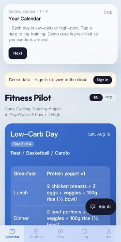

# Fitness Pilot

碳循环训练助手（Next.js + TypeScript）。

## Quickstart

```bash
npm install
npm run dev
# open http://localhost:3000
```

## 自动云存储（Firebase Spark 免费计划）

配置后，数据会**自动保存到云端**。电脑改完，手机登录同一账号打开就是最新数据，无需复制粘贴。

### 1) 创建 Firebase 项目

1. 打开 [Firebase Console](https://console.firebase.google.com/)
2. 创建项目（选择 **Spark / Free** 计划）
3. 开启 **Authentication**：
   - Email/Password（可选，邮箱登录用）
   - **Google**（社交登录）
4. 开启 **Firestore Database**

#### 开启 Google 登录

1. Firebase Console → **Authentication** → **Sign-in method**
2. 点击 **Google** → **Enable** → 填写 support email → Save
3. 本地开发时 `localhost` 一般已在 **Authorized domains** 里
4. 部署到 Vercel 后，把生产域名（如 `xxx.vercel.app`）加到 **Authorized domains**

### 2) 添加 Web App，填写环境变量

复制 `.env.example` 为 `.env.local` 并填入 Firebase 配置：

```bash
cp .env.example .env.local
```

### 3) Firestore 安全规则（必做）

Firebase Console → **Firestore Database** → **Rules** 标签，**整段替换**为以下内容，点 **Publish**：

```txt
rules_version = '2';
service cloud.firestore {
  match /databases/{database}/documents {
    match /users/{userId}/data/{doc} {
      allow read, write: if request.auth != null && request.auth.uid == userId;
    }
  }
}
```

（项目根目录也有 `firestore.rules` 文件可复制。）

> 若创建数据库时选了 **test mode**，默认规则 30 天后会过期，也会出现 `Missing or insufficient permissions`，同样需要改成上面的规则。

### 4) 使用方式

1. 电脑端：用 **Google 登录** 或邮箱注册
2. 手机端：用**同一 Google 账号**（或同一邮箱密码）登录
3. 之后所有修改自动同步，无需手动操作

> 未配置 Firebase 时，应用会退化为仅本地 `localStorage` 存储。

## Build

```bash
npm run build
npm run start
```

## AI coach (streaming)

`POST /api/coach` streams Gemini replies as SSE (`text/event-stream`). The floating coach UI appends `{ text }` chunks into the assistant bubble as they arrive (token-by-token), then closes on `{ done: true }`.

Requires server env `GEMINI_API_KEY` (see `.env.example`).

## Core Web Vitals

Optimizations aimed at LCP / CLS / INP:

- Early brand paint during auth/hydrate (`ShellLoading`) so LCP text is not blocked on a blank spinner
- Fixed-height slot for the guest banner to avoid layout shift when it appears
- Defer ambient orb motion until idle; lighter blur (no always-on `will-change`)
- `next/dynamic` for ambient field, floating coach corner, and the profile weight chart
- `next/font` with `display: 'swap'` + `adjustFontFallback`

### Measured scores (Lighthouse 12, mobile simulation)

| Target | Perf | LCP | CLS | FCP | SI |
| --- | ---: | ---: | ---: | ---: | ---: |
| Local (`npm run build && start`) after CWV work | **84** | 4.6 s | **0** | 0.8 s | 1.5 s |
| Production baseline (pre-deploy) | 67 | 6.0 s | 0 | 4.2 s | 4.9 s |

LCP under lab mobile throttling is still dominated by client auth/hydrate; field numbers on a warm CDN are typically better. Re-check after deploy:

```bash
npm run cwv
```

Evidence screenshots (lab filmstrip / final frame):




Raw summary: [`docs/cwv/metrics.json`](docs/cwv/metrics.json).

## SEO

生产域名：`https://fitness-pilot.vercel.app`（代码里已作为默认 canonical；也可设 `NEXT_PUBLIC_SITE_URL`）。

上线后建议：

1. 在 [Google Search Console](https://search.google.com/search-console) 用「网址前缀」验证 `https://fitness-pilot.vercel.app`，并提交 sitemap：  
   `https://fitness-pilot.vercel.app/sitemap.xml`
2. （可选）在 [Bing Webmaster Tools](https://www.bing.com/webmasters) 同样提交
3. 用 [Facebook Sharing Debugger](https://developers.facebook.com/tools/debug/) 或类似工具预览分享卡片
